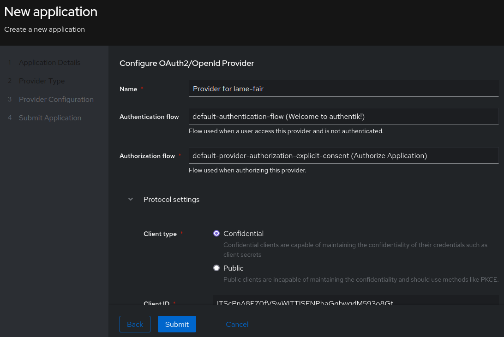
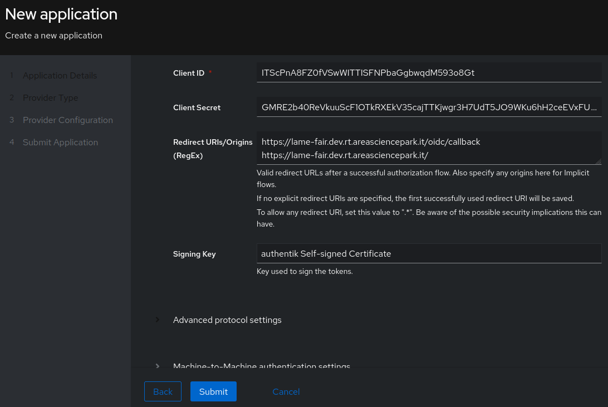

# How to integrate a Django app in the *VirtualOrfeo* test environment
## Introduction
VirtualOrfeo is a virtualized replica (digital twin) of the Orfeo HPC cluster.
It provides a sandboxed environment where users can safely test and develop HPC workflows without impacting the production system.
It's built using virtualization technologies like KVM/QEMU/Libvirt, it integrates Kubernetes (k3s), Slurm workload manager, and FreeIPA for authentication and resource management.

MinIO is a high-performance, S3-compatible object storage system designed for cloud-native environments. 
It's open-source, lightweight, and optimized for handling large-scale data workloads, making it ideal for Kubernetes-based applications.

Authentik is an open-source identity provider (IdP) that supports single sign-on (SSO), OAuth2, OIDC, and SAML authentication.
In VirtualOrfeo it works alongside FreeIPA, providing authentication mechanisms and federated identity management for web applications and services.

The guide below explains how to integrate a Django-based web application in a VirtualOrfeo instance where Authentik (as an OIDC provider) and MinIO (as object storage system) have also been set up.

For more informations refer to:

* [VirtualOrfeo](https://gitlab.com/area7/datacenter/codes/virtualorfeo)
* [MinIO](https://min.io/)
* [Authentik](https://goauthentik.io/)
---

## Table of contents
0. [Prerequisites](#prerequisites)
1. [Installation](#installation)
2. [Create a new OIDC application + provider in Authentik](#create-a-new-oidc-application--provider-in-authentik)
3. [MinIO Setup](#minio-setup)
4. [Secrets and configurations](#secrets-and-configurations)
5. [Kubernetes setup](#kubernetes-setup)
6. [Troubleshooting](#troubleshooting)
---

## Prerequisites

This guide assumes you have already set up VirtualOrfeo with FreeIPA, Authentik inside of it.

Here we will explain how to register the Django web application contained in this repository as a client in Authentik.

---

## Installation

Clone the application repository and prepare your local environment:
   ```bash
   git clone https://gitlab.com/area7/nffa-di/lame_fair_by_design.git
   cd lame_fair_by_design
   git switch feature/virtualorfeo_integration

   python -m venv venv
   source venv/bin/activate
   pip install -r requirements.txt
   ```
---

## Create a new OIDC application + provider in Authentik

- Open Authentik’s admin UI at https://auth.k3s.virtualorfeo.it/if/admin/
- In the left menu, go to Applications → Applications
- Click “Create with Wizard” (if your Authentik version supports it) or manually create an Application + Provider

You should now see the following window:

{width=70%}

Fill out the application details as follows:
   - **Name**: lame-fair
   - **Slug**: lame-fair
   - **Launch URL**: https://lame-fair.dev.rt.areasciencepark.it/
   - **Policy engine mode**: any

In the Provider Type tab select `OAuth2/OIDC` (Open Authorization/OpenID Connect) entry and click on Next.

In the first configuration section:
   - **Name**: Provider for lame-app.
   - **Authentication flow**: default-authentication-flow (Welcome to Authentik)
   - **Authorization flow**: default-provider-authorization-explicit-consent (Authorize Application)

{width=70%}

In the Protocol Settings section:
   - **Client type**: Confidential
   - **Redirect URIs/Origins (RegEx)**: https://lame-fair.dev.rt.areasciencepark.it/oidc/callback/ https://lame-fair.dev.rt.areasciencepark.it/ (set both of them)

{width=70%}

Take note of the `Client ID` and `Client Secret`, you will need them later.

In the Advanced protocol settings tab check that these scopes are selected, and select them if they aren't:

{width=70%}

## MinIO Setup

1. Update MinIO Client ID and Secret in `$HOME/orfeokuboverlay/minio/dev/kustomization.yaml` and apply changes:
   ```bash
   kustomize build dev > dev/manifest.yaml
   kubectl apply -f dev/manifest.yaml
   ```

2. To avoid incurring into file size limits imposed by the NginX web server used in *virtualorfeo*, in the `$HOME/orfeokuboverlay/minio/dev/ingress.yaml` file you need to add an annotation to increase the allowed request (body) size:
   ```bash
   apiVersion: networking.k8s.io/v1
   kind: Ingress
   metadata:
      name: minio-ingress
      annotations:
         cert-manager.io/cluster-issuer: ipa
         nginx.ingress.kubernetes.io/proxy-body-size: 1024m # <--- add this line here
   ```
   and then apply with:
   ```bash
   kubectl apply -f $HOME/orfeokuboverlay/minio/dev/ingress.yaml -n minio-dev
   ```
3. Set Kubernetes environment variable::
   ```bash
   export KUBECONFIG=$HOME/virtualorfeo/playbooks/kube_config
   ```
4. Access the MinIO console at `https://minio.k3s.virtualorfeo.it/` and create a new bucket named `lame-bucket`.

5. Install the MinIO client (mc) from MinIO’s official source:
   ```bash
   curl https://dl.min.io/client/mc/release/linux-amd64/mc \
   --create-dirs \
   -o $HOME/minio-binaries/mc

   chmod +x $HOME/minio-binaries/mc
   export PATH=$PATH:$HOME/minio-binaries/
   ```

   create an user and assign a policy to it:
   ```bash
   mc config host add myminio https://s3.k3s.virtualorfeo.it admin 12345678
   mc admin policy create myminio lame-policy lame-policy.json
   mc admin user add myminio lame-app-user <minio-user-password>
   mc admin policy attach myminio lame-policy --user lame-app-user
   ```

## Secrets and configurations
Now move to the project's root folder:
   ```bash
   cd $HOME/lame_fair_by_design/
   ```
1. Create a file named `lame-fair-secrets.yaml` copying this template:
   ```bash
   apiVersion: v1
   kind: Secret
   metadata:
      name: lame-fair-secrets
      namespace: lame-fair
   type: Opaque
   data:
      DJANGO_SECRET_KEY: <base64-django-secret-key>
      OIDC_RP_CLIENT_SECRET: <base64-lame-fair-authentik-client-secret>
      MINIO_SECRET_KEY: <base64-minio-user-password>
   ```

   Create a django secret key and transform it into base64:
   ```bash
   python -c 'from django.core.management.utils import get_random_secret_key; print(get_random_secret_key())' | base64
   ```
   this is the `DJANGO_SECRET_KEY` in the secrets file.

   Encode and insert Client Secret of the lame-app  from Authentik and `<minio-user-password>` similarly.

2. Edit `lame-fair-config.yaml` inserting your Authentik Client ID under `OIDC_RP_CLIENT_ID`.
Unlike secrets, config values don’t have to be converted into base64.

3. Create a `certs` folder and a file to store the required certificate:
   ```bash
   mkdir -p certs/
   touch certs/freeipa-lame.crt
   ```

   obtain the certificates chain:
   ```bash
   kubectl get secrets --namespace authentik authentik-tls -o yaml | awk '/tls\.crt/{print $2}' | base64 --decode > /tmp/chain.pem
   cat /tmp/chain.pem
   ```

   Copy the last certificate from the chain into `freeipa-lame.crt`.

## Kubernetes setup

1. Create a namespace for your app in the kubernetes environment:
   ```bash
   kubectl create namespace lame-fair
   ```

2. connect to the container registry of the repository:
   ```bash
   kubectl create secret docker-registry gitlab-regcred --docker-server=registry.gitlab.com --docker-username=<your-username> --docker-password=<your-personal-access-token> --docker-email=<your-email> -n lame-fair
   ```

3. Log into the registry, build, and push the Docker image:
   ```bash
   podman login registry.gitlab.com
   podman build -t registry.gitlab.com/area7/nffa-di/lame_fair_by_design:<your-image-tag> .
   podman push registry.gitlab.com/area7/nffa-di/lame_fair_by_design:<your-image-tag>
   ```
   (use your Personal Access Token as password).

4. Make sure the image name and tag you chose are correctly reflected into the `deployment.yaml` file. Apply the configuration:
   ```bash
   kubectl apply -f lame-fair-secrets.yaml
   kubectl apply -f lame-fair-config.yaml
   kubectl apply -f service.yaml
   kubectl apply -f ingress.yaml
   kubectl apply -f nginx-config.yaml
   kubectl apply -f deployment.yaml
   ```

5. Verify your deployment by accessing:
   ```bash
   https://lame-fair.dev.rt.areasciencepark.it/
   ```

6. If you update your application, rebuild the image, push it, and restart the deployment:
   ```bash
   kubectl rollout restart deployment lame-fair-app -n lame-fair
   ```

## Troubleshooting

If you run into disk pressure issues with the `kube01` node, it means there is not enough disk space to download your container image.
This is a workaround:
   ```bash
   cd $HOME/virtualorfeo/vagrantfiles/k3s_nodes
   vagrant halt kube01
   sudo qemu-img resize /var/lib/libvirt/images/k3s_nodes_kube01.img +10G
   vagrant up kube01
   vagrant ssh kube01
   ```

Inside the node run:
   ```bash
   sudo growpart /dev/vda 4
   sudo btrfs filesystem resize max /
   ```
Check the current disk usage with `df -h` to make sure it worked and exit.


